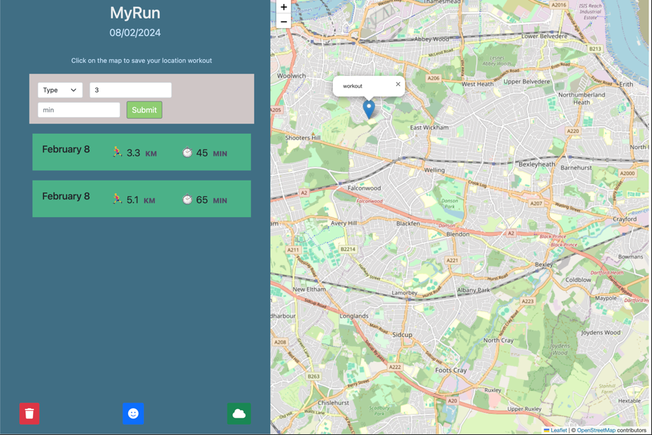

# MyRun
Application to record running workouts

* The app is designed to log a user's running activity and store it in their local storage.
* The app uses three icons for reset, inspirational quotes, and weather functionalities.
* Upon restart, the app requests consent to use the user's location  and allows them to mark their run distance..
* The weather feature of the app can summarize the weather of any location chosen by the user.
* The app provides the user with randomly selected inspirational quotes.

*** User Story *** 
- As a user, I want to log my running workouts with location, distance and  time, so I can keep a log of all my running  activities. 
- As a user, I want to see all my workouts at a glance, so I can easily track my progress over time. 
- As a user, I want also see my workouts on a map, so I can easily check where I work out the most. 

----------------------------------

The following image demonstrates the web application's appearance and functionality:
 

Deployed link: <https://anarab.github.io/MyRun/>

-------------------------------------------------------------------------
The development of the 'MyRun' app was a collaborative effort within an agile methodology during the Front-end Web Developer bootcamp.

### Contributors:
* Aygerim Berdalieva

* Eyram Tetteh
 
* Esther Adeola Elujoba
 
* Teddy F Willie

 

